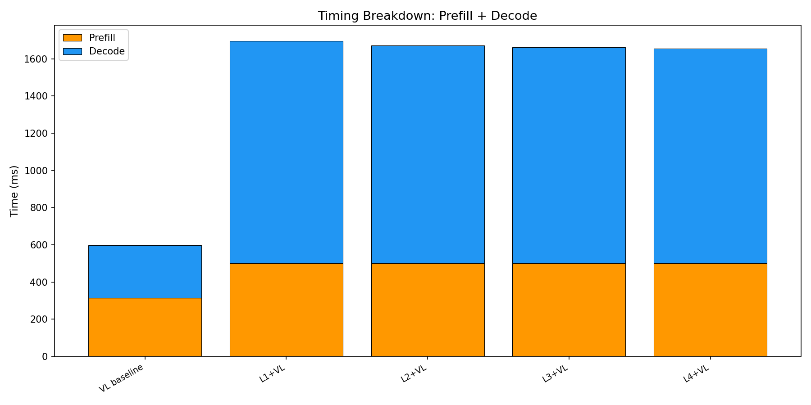
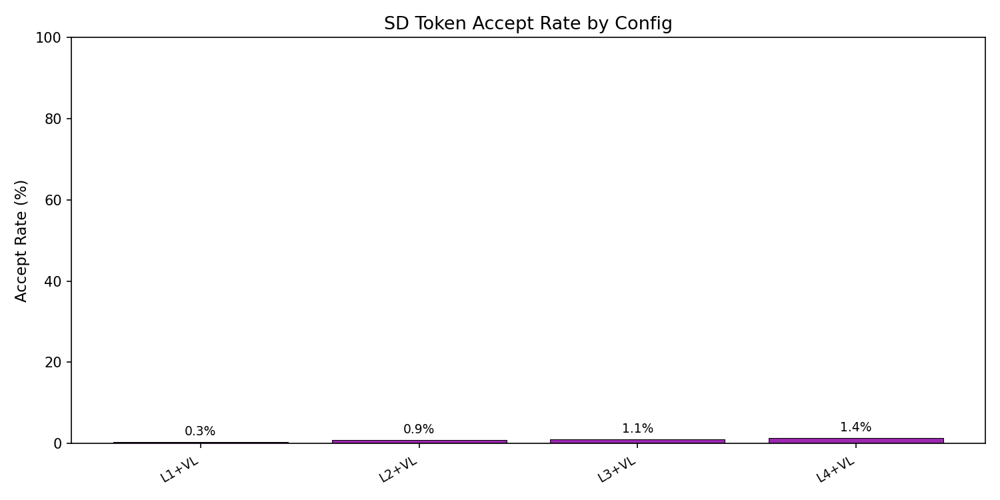

# E2E Wall-Clock Benchmark — All Methods

Generated: 2026-02-07T08:07:10.116484

## Configuration
- Dataset: `/mnt/hdd/data/my_egpt_dsec_test/my_egpt_dsec_seq_1s`
- Samples: 500 (after 3 warmup)
- Questions: 10
- Max tokens: 20, gamma: 5

## Results

| Config | Prefill (ms) | Decode (ms) | Total (ms) | Accept | Speedup |
|--------|-------------|------------|-----------|--------|---------|
| VL baseline | 315 | 282 | 597 | --- | 1.00x |
| L1+VL | 501 | 1195 | 1894 | 0.3% | **0.32x** |
| L2+VL | 501 | 1172 | 1870 | 0.9% | **0.32x** |
| L3+VL | 501 | 1162 | 1860 | 1.1% | **0.32x** |
| L4+VL | 501 | 1153 | 1852 | 1.4% | **0.32x** |

## 3-Stage Timing (Both Models)

| Model | Vision (ms) | Prefill (ms) | Decode (ms) | Total (ms) | ms/token |
|-------|------------|-------------|------------|-----------|----------|
| EventGPT | 7.6 | 83.2 | 194.4 | 285.2 | 9.7 |
| Video-LLaVA | 0.0 | 315.2 | 281.8 | 596.9 | 14.1 |

## Graphs

