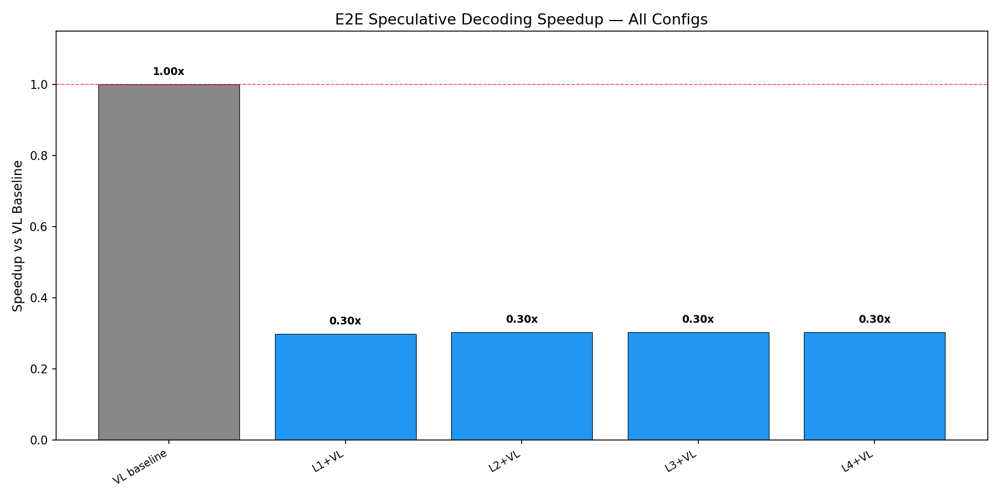
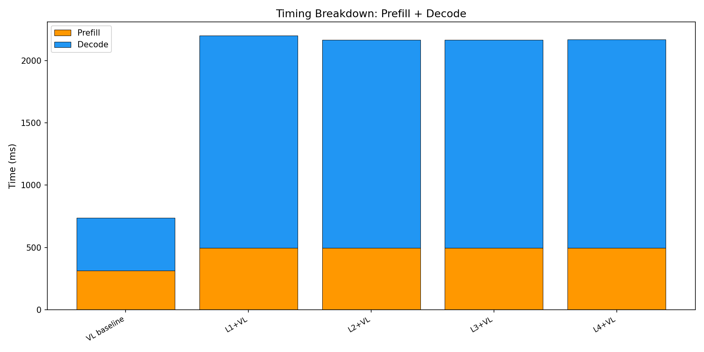
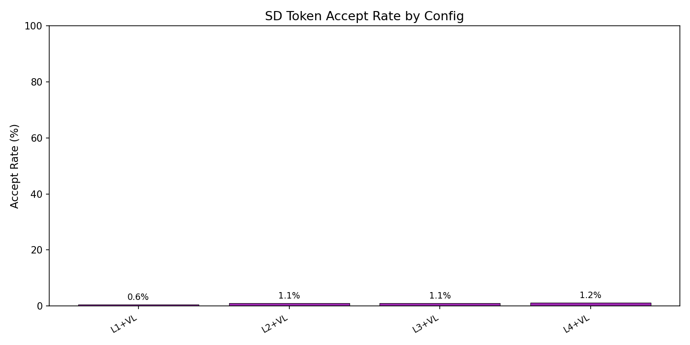

# E2E Wall-Clock Benchmark — All Methods

Generated: 2026-02-07T07:09:05.018419

## Configuration
- Dataset: `/mnt/hdd/data/my_egpt_dsec_test/my_egpt_dsec_seq_1s`
- Samples: 500 (after 3 warmup)
- Questions: 10
- Max tokens: 30, gamma: 5

## Results

| Config | Prefill (ms) | Decode (ms) | Total (ms) | Accept | Speedup |
|--------|-------------|------------|-----------|--------|---------|
| VL baseline | 315 | 422 | 737 | --- | 1.00x |
| L1+VL | 497 | 1703 | 2480 | 0.6% | **0.30x** |
| L2+VL | 497 | 1669 | 2446 | 1.1% | **0.30x** |
| L3+VL | 497 | 1667 | 2444 | 1.1% | **0.30x** |
| L4+VL | 497 | 1670 | 2447 | 1.2% | **0.30x** |

## 3-Stage Timing (Both Models)

| Model | Vision (ms) | Prefill (ms) | Decode (ms) | Total (ms) | ms/token |
|-------|------------|-------------|------------|-----------|----------|
| EventGPT | 7.6 | 83.1 | 296.1 | 386.8 | 9.9 |
| Video-LLaVA | 0.0 | 314.8 | 427.1 | 741.9 | 14.2 |

## Graphs

