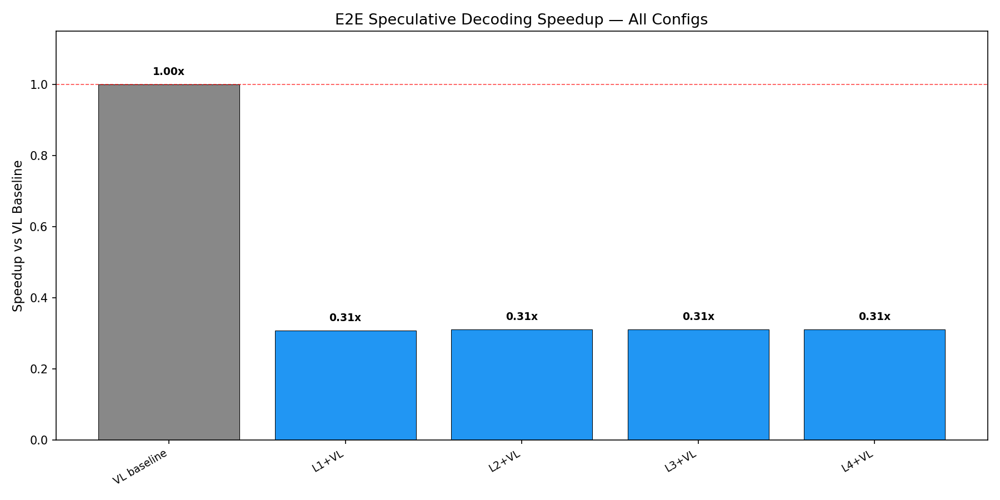
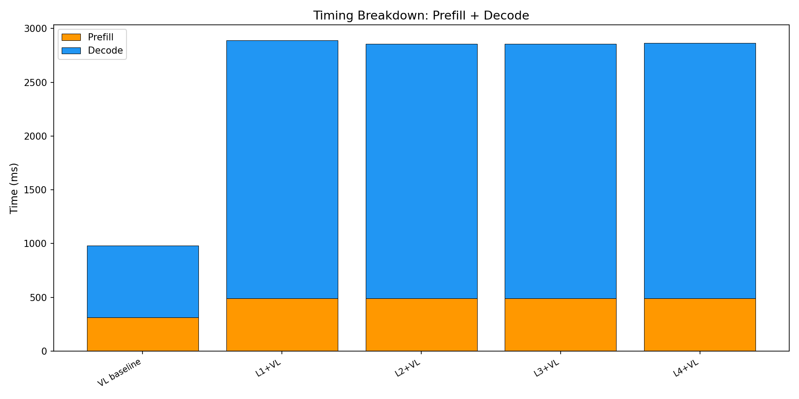
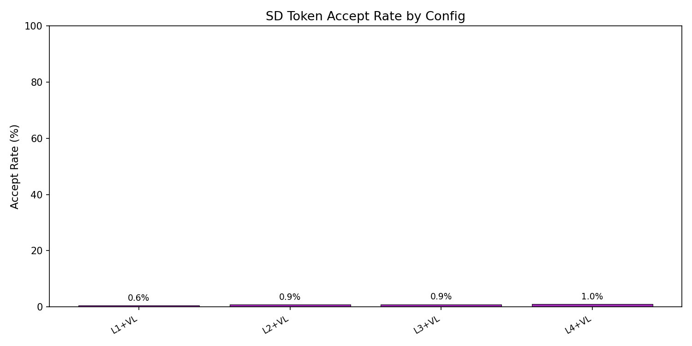

# E2E Wall-Clock Benchmark — All Methods

Generated: 2026-02-07T05:51:03.628489

## Configuration
- Dataset: `/mnt/hdd/data/my_egpt_dsec_test/my_egpt_dsec_seq_1s`
- Samples: 500 (after 3 warmup)
- Questions: 10
- Max tokens: 50, gamma: 5

## Results

| Config | Prefill (ms) | Decode (ms) | Total (ms) | Accept | Speedup |
|--------|-------------|------------|-----------|--------|---------|
| VL baseline | 315 | 666 | 981 | --- | 1.00x |
| L1+VL | 492 | 2398 | 3275 | 0.6% | **0.31x** |
| L2+VL | 492 | 2365 | 3241 | 0.9% | **0.31x** |
| L3+VL | 492 | 2364 | 3241 | 0.9% | **0.31x** |
| L4+VL | 492 | 2375 | 3251 | 1.0% | **0.31x** |

## 3-Stage Timing (Both Models)

| Model | Vision (ms) | Prefill (ms) | Decode (ms) | Total (ms) | ms/token |
|-------|------------|-------------|------------|-----------|----------|
| EventGPT | 7.5 | 83.2 | 454.3 | 545.0 | 10.0 |
| Video-LLaVA | 0.0 | 315.1 | 721.8 | 1036.8 | 14.4 |

## Graphs

