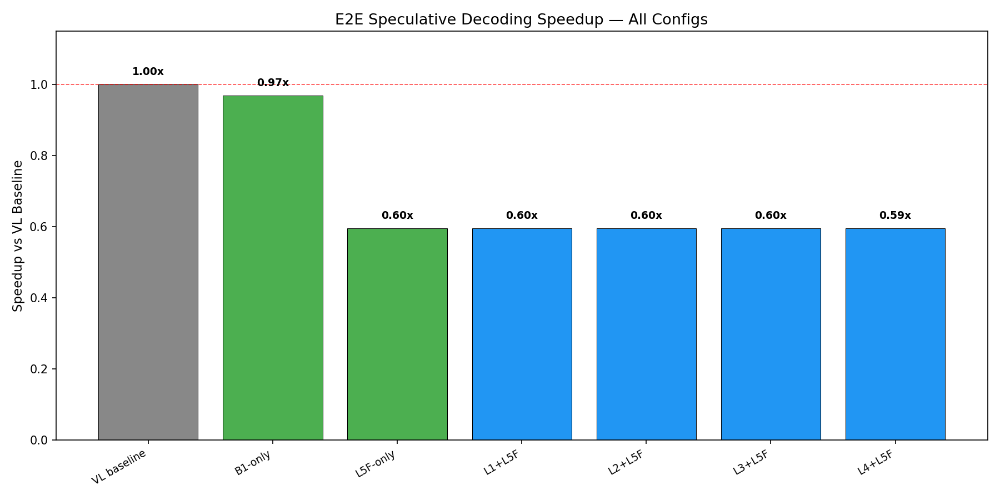
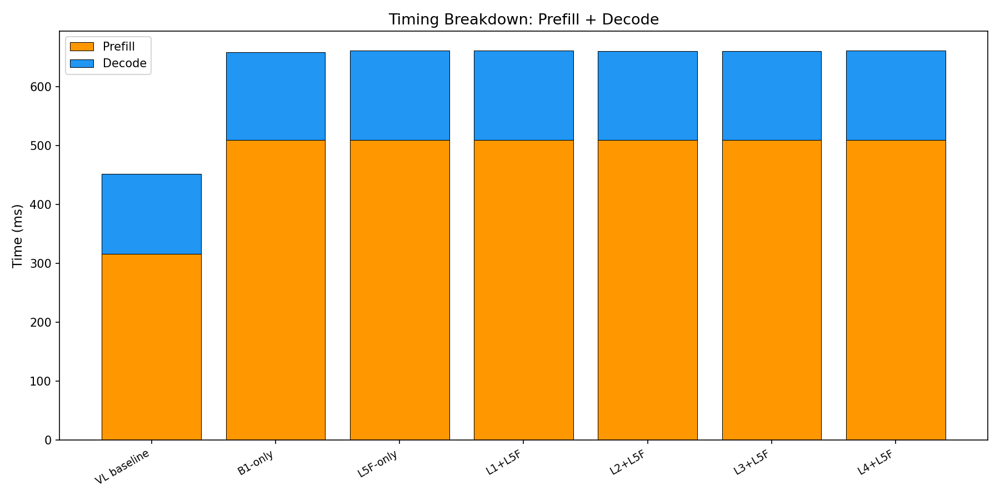
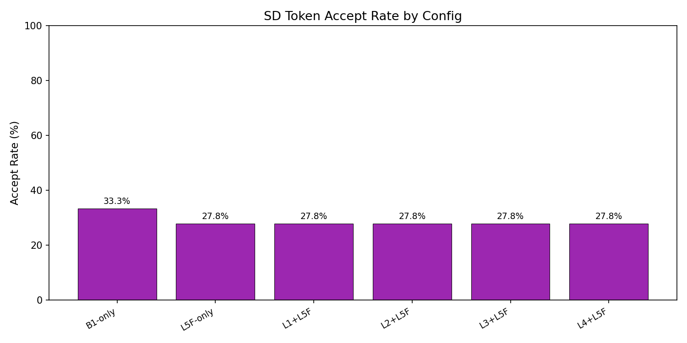

# E2E Wall-Clock Benchmark — All Methods

Generated: 2026-02-07T02:37:22.879187

## Configuration
- Dataset: `./data/my_egpt_dsec_test/my_egpt_dsec_seq_1s`
- Samples: 10 (after 0 warmup)
- Questions: 10
- Max tokens: 10, gamma: 5

## Results

| Config | Prefill (ms) | Decode (ms) | Total (ms) | Accept | Speedup |
|--------|-------------|------------|-----------|--------|---------|
| VL baseline | 316 | 136 | 452 | --- | 1.00x |
| B1-only | 509 | 149 | 466 | 33.3% | **0.97x** |
| L5F-only | 509 | 151 | 759 | 27.8% | **0.60x** |
| L1+L5F | 509 | 151 | 759 | 27.8% | **0.60x** |
| L2+L5F | 509 | 151 | 759 | 27.8% | **0.60x** |
| L3+L5F | 509 | 151 | 759 | 27.8% | **0.60x** |
| L4+L5F | 509 | 152 | 760 | 27.8% | **0.59x** |

## 3-Stage Timing (Both Models)

| Model | Vision (ms) | Prefill (ms) | Decode (ms) | Total (ms) | ms/token |
|-------|------------|-------------|------------|-----------|----------|
| EventGPT | 126.7 | 136.2 | 98.8 | 361.7 | 9.9 |
| Video-LLaVA | 0.0 | 347.4 | 141.8 | 489.2 | 14.2 |

## Graphs

