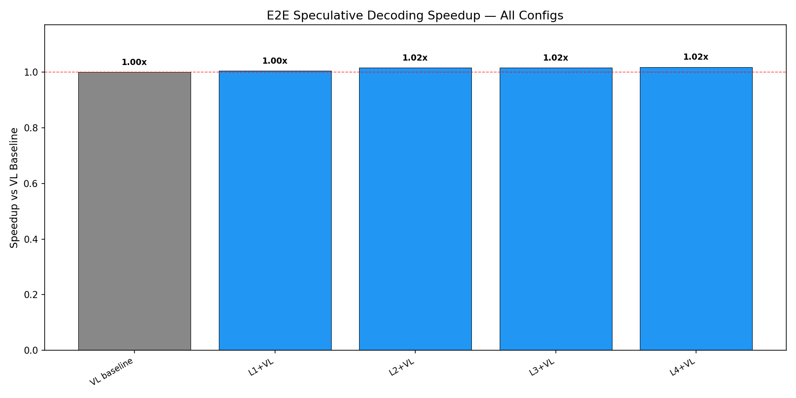
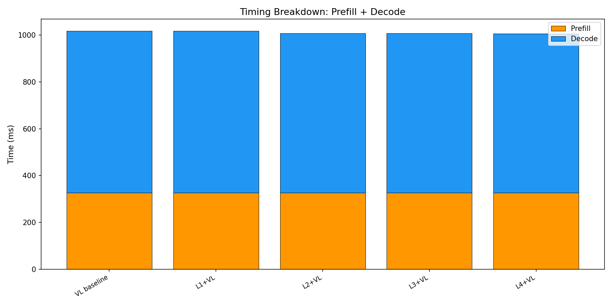
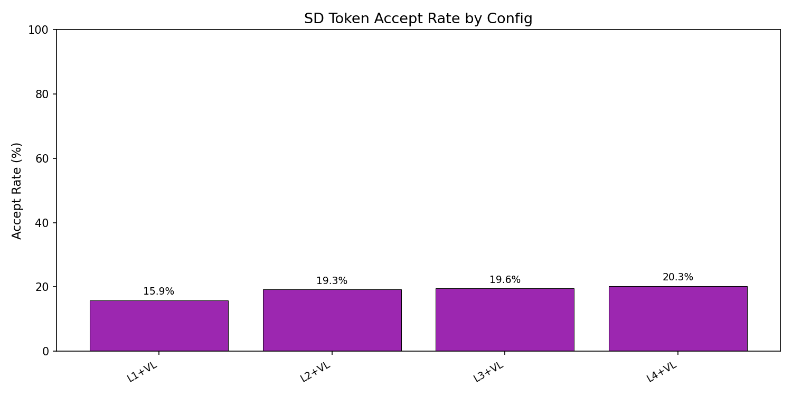

# E2E Wall-Clock Benchmark — All Methods

Generated: 2026-02-07T12:20:42.456583

## Configuration
- Dataset: `/mnt/hdd/data/my_egpt_dsec_test/my_egpt_dsec_seq_1s`
- Samples: 500 (after 3 warmup)
- Questions: 10
- Max tokens: 50, gamma: 5

## Results

| Config | Prefill (ms) | Decode (ms) | Total (ms) | Accept | Speedup | FreeTok |
|--------|-------------|------------|-----------|--------|---------|---------|
| VL baseline | 326 | 691 | 1017 | --- | 1.00x | --- |
| L1+VL | 326 | 691 | 1018 | 15.9% | **1.00x** | 21.9 |
| L2+VL | 326 | 681 | 1007 | 19.3% | **1.02x** | 21.9 |
| L3+VL | 326 | 681 | 1007 | 19.6% | **1.02x** | 21.9 |
| L4+VL | 326 | 679 | 1005 | 20.3% | **1.02x** | 21.9 |

## 3-Stage Timing (Both Models)

| Model | Vision (ms) | Prefill (ms) | Decode (ms) | Total (ms) | ms/token |
|-------|------------|-------------|------------|-----------|----------|
| EventGPT | 8.2 | 86.1 | 470.8 | 565.0 | 10.4 |
| Video-LLaVA | 0.0 | 325.4 | 746.2 | 1071.7 | 14.9 |

## Graphs

