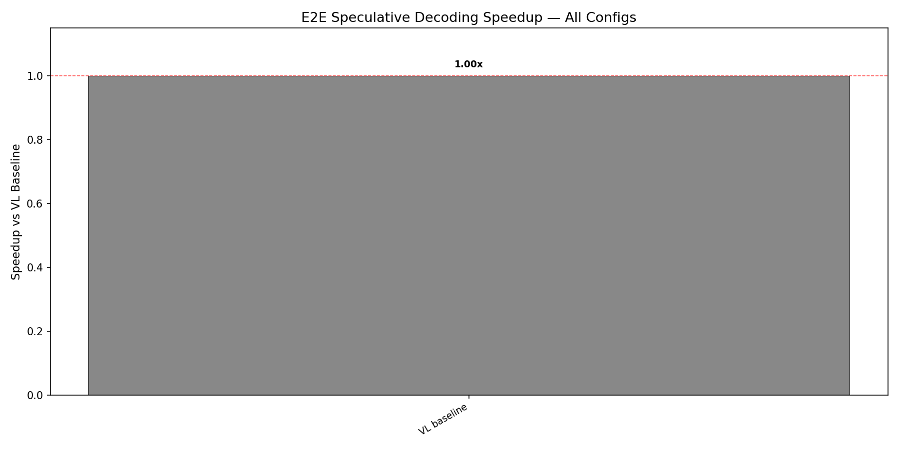
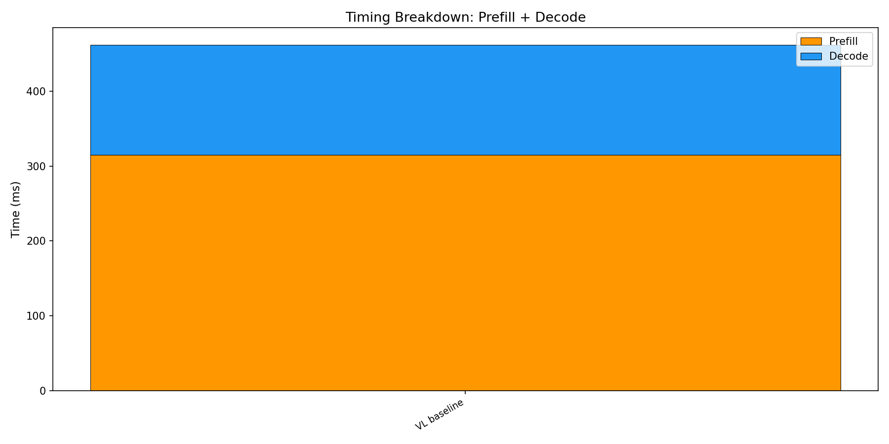

# E2E Wall-Clock Benchmark — All Methods

Generated: 2026-02-07T02:27:42.954878

## Configuration
- Dataset: `./data/my_egpt_dsec_test/my_egpt_dsec_seq_1s`
- Samples: 10 (after 0 warmup)
- Questions: 10
- Max tokens: 10, gamma: 5

## Results

| Config | Prefill (ms) | Decode (ms) | Total (ms) | Accept | Speedup |
|--------|-------------|------------|-----------|--------|---------|
| VL baseline | 315 | 147 | 462 | --- | 1.00x |

## 3-Stage Timing (Both Models)

| Model | Vision (ms) | Prefill (ms) | Decode (ms) | Total (ms) | ms/token |
|-------|------------|-------------|------------|-----------|----------|
| EventGPT | 130.8 | 140.5 | 97.0 | 368.4 | 9.7 |
| Video-LLaVA | 0.0 | 356.0 | 140.8 | 496.7 | 14.1 |

## Graphs

