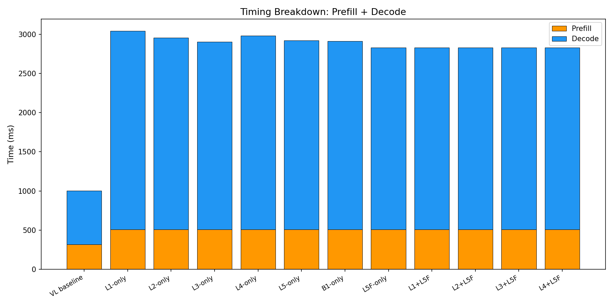
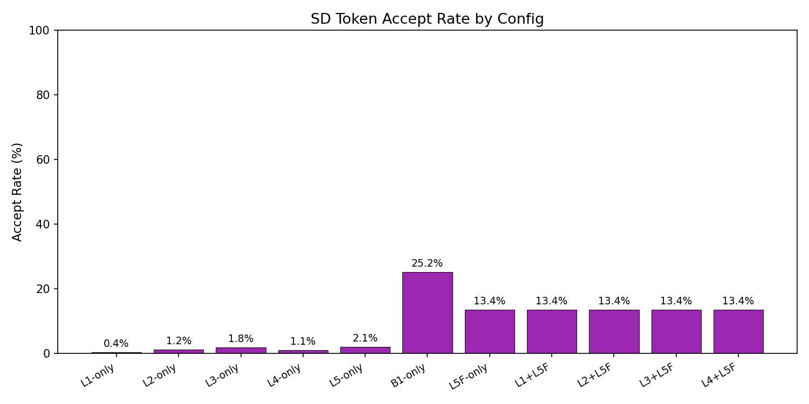

# E2E Wall-Clock Benchmark — All Methods

Generated: 2026-02-07T03:34:56.422999

## Configuration
- Dataset: `/mnt/hdd/data/my_egpt_dsec_test/my_egpt_dsec_seq_1s`
- Samples: 10 (after 0 warmup)
- Questions: 10
- Max tokens: 50, gamma: 5

## Results

| Config | Prefill (ms) | Decode (ms) | Total (ms) | Accept | Speedup |
|--------|-------------|------------|-----------|--------|---------|
| VL baseline | 316 | 689 | 1005 | --- | 1.00x |
| L1-only | 510 | 2532 | 3436 | 0.4% | **0.30x** |
| L2-only | 510 | 2444 | 3347 | 1.2% | **0.31x** |
| L3-only | 510 | 2395 | 3298 | 1.8% | **0.31x** |
| L4-only | 510 | 2473 | 3376 | 1.1% | **0.30x** |
| L5-only | 510 | 2410 | 3313 | 2.1% | **0.31x** |
| B1-only | 510 | 2402 | 2720 | 25.2% | **0.37x** |
| L5F-only | 510 | 2321 | 3224 | 13.4% | **0.32x** |
| L1+L5F | 510 | 2320 | 3224 | 13.4% | **0.32x** |
| L2+L5F | 510 | 2320 | 3223 | 13.4% | **0.32x** |
| L3+L5F | 510 | 2320 | 3224 | 13.4% | **0.32x** |
| L4+L5F | 510 | 2320 | 3223 | 13.4% | **0.32x** |

## 3-Stage Timing (Both Models)

| Model | Vision (ms) | Prefill (ms) | Decode (ms) | Total (ms) | ms/token |
|-------|------------|-------------|------------|-----------|----------|
| EventGPT | 132.6 | 132.4 | 346.6 | 611.6 | 10.2 |
| Video-LLaVA | 0.0 | 347.0 | 732.7 | 1079.8 | 14.7 |

## Graphs

