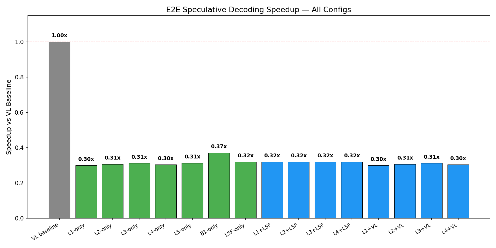
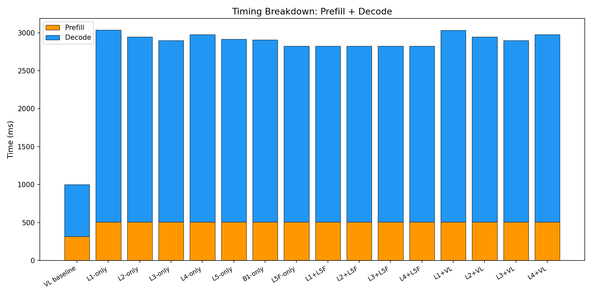
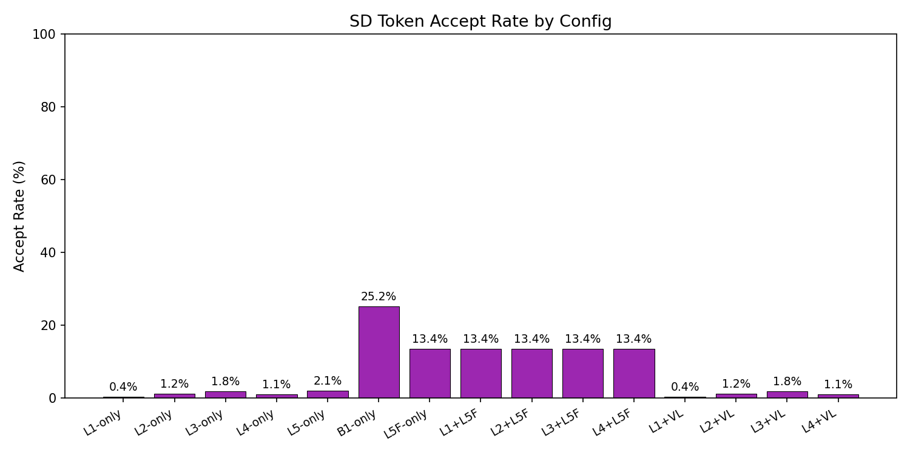

# E2E Wall-Clock Benchmark — All Methods

Generated: 2026-02-07T03:45:06.613625

## Configuration
- Dataset: `/mnt/hdd/data/my_egpt_dsec_test/my_egpt_dsec_seq_1s`
- Samples: 10 (after 0 warmup)
- Questions: 10
- Max tokens: 50, gamma: 5

## Results

| Config | Prefill (ms) | Decode (ms) | Total (ms) | Accept | Speedup |
|--------|-------------|------------|-----------|--------|---------|
| VL baseline | 316 | 686 | 1003 | --- | 1.00x |
| L1-only | 508 | 2530 | 3435 | 0.4% | **0.30x** |
| L2-only | 508 | 2441 | 3346 | 1.2% | **0.31x** |
| L3-only | 508 | 2392 | 3297 | 1.8% | **0.31x** |
| L4-only | 508 | 2470 | 3375 | 1.1% | **0.30x** |
| L5-only | 508 | 2407 | 3313 | 2.1% | **0.31x** |
| B1-only | 508 | 2399 | 2716 | 25.2% | **0.37x** |
| L5F-only | 508 | 2318 | 3223 | 13.4% | **0.32x** |
| L1+L5F | 508 | 2317 | 3223 | 13.4% | **0.32x** |
| L2+L5F | 508 | 2317 | 3223 | 13.4% | **0.32x** |
| L3+L5F | 508 | 2317 | 3223 | 13.4% | **0.32x** |
| L4+L5F | 508 | 2317 | 3223 | 13.4% | **0.32x** |
| L1+VL | 508 | 2527 | 3433 | 0.4% | **0.30x** |
| L2+VL | 508 | 2440 | 3346 | 1.2% | **0.31x** |
| L3+VL | 508 | 2392 | 3298 | 1.8% | **0.31x** |
| L4+VL | 508 | 2470 | 3376 | 1.1% | **0.30x** |

## 3-Stage Timing (Both Models)

| Model | Vision (ms) | Prefill (ms) | Decode (ms) | Total (ms) | ms/token |
|-------|------------|-------------|------------|-----------|----------|
| EventGPT | 121.1 | 139.4 | 348.8 | 609.4 | 10.3 |
| Video-LLaVA | 0.0 | 345.7 | 739.5 | 1085.2 | 14.8 |

## Graphs

