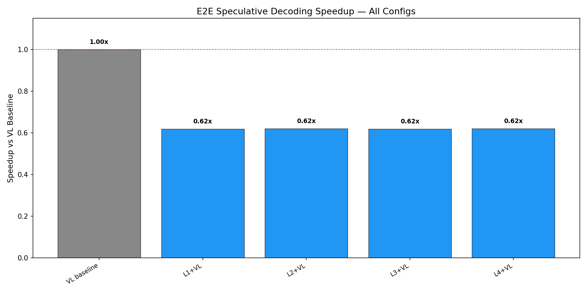
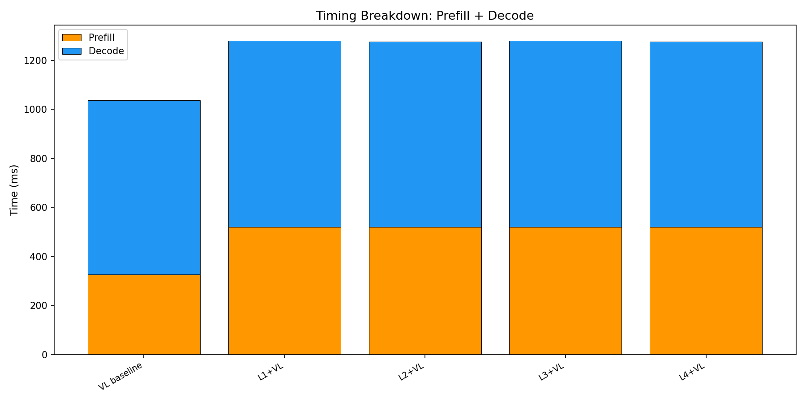

# E2E Wall-Clock Benchmark — All Methods

Generated: 2026-02-07T10:40:00.097471

## Configuration
- Dataset: `/mnt/hdd/data/my_egpt_dsec_test/my_egpt_dsec_seq_1s`
- Samples: 10 (after 0 warmup)
- Questions: 10
- Max tokens: 50, gamma: 5

## Results

| Config | Prefill (ms) | Decode (ms) | Total (ms) | Accept | Speedup |
|--------|-------------|------------|-----------|--------|---------|
| VL baseline | 327 | 710 | 1037 | --- | 1.00x |
| L1+VL | 521 | 759 | 1681 | 0.0% | **0.62x** |
| L2+VL | 521 | 756 | 1679 | 0.0% | **0.62x** |
| L3+VL | 521 | 758 | 1681 | 0.0% | **0.62x** |
| L4+VL | 521 | 755 | 1678 | 0.0% | **0.62x** |

## 3-Stage Timing (Both Models)

| Model | Vision (ms) | Prefill (ms) | Decode (ms) | Total (ms) | ms/token |
|-------|------------|-------------|------------|-----------|----------|
| EventGPT | 124.5 | 134.3 | 353.5 | 612.3 | 10.4 |
| Video-LLaVA | 0.0 | 357.6 | 747.2 | 1104.8 | 14.9 |

## Graphs

