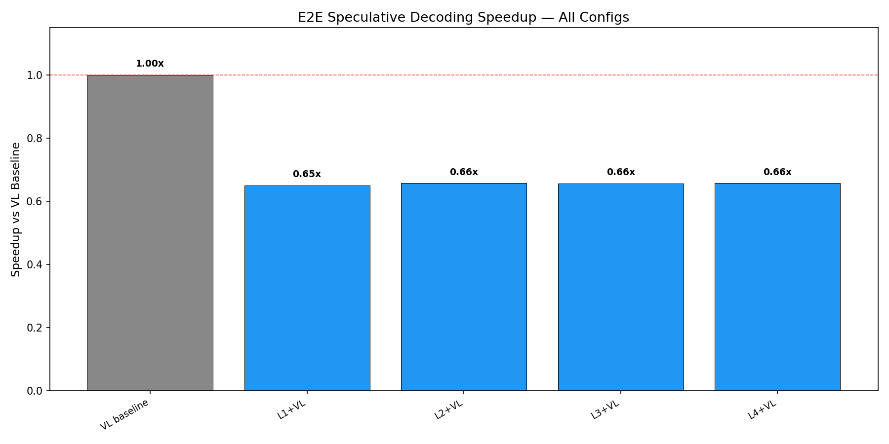
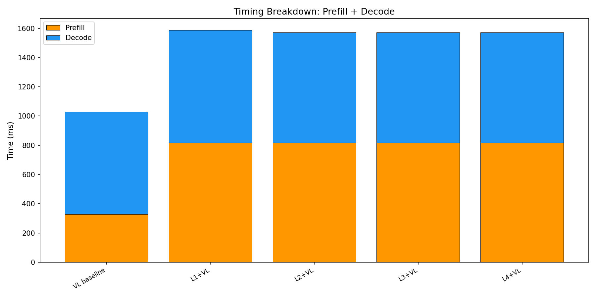

# E2E Wall-Clock Benchmark — All Methods

Generated: 2026-02-07T10:47:37.785145

## Configuration
- Dataset: `/mnt/hdd/data/my_egpt_dsec_test/my_egpt_dsec_seq_1s`
- Samples: 10 (after 0 warmup)
- Questions: 10
- Max tokens: 50, gamma: 5

## Results

| Config | Prefill (ms) | Decode (ms) | Total (ms) | Accept | Speedup |
|--------|-------------|------------|-----------|--------|---------|
| VL baseline | 328 | 701 | 1029 | --- | 1.00x |
| L1+VL | 819 | 769 | 1588 | 0.0% | **0.65x** |
| L2+VL | 819 | 753 | 1571 | 0.0% | **0.66x** |
| L3+VL | 819 | 754 | 1573 | 0.0% | **0.66x** |
| L4+VL | 819 | 753 | 1572 | 0.0% | **0.66x** |

## 3-Stage Timing (Both Models)

| Model | Vision (ms) | Prefill (ms) | Decode (ms) | Total (ms) | ms/token |
|-------|------------|-------------|------------|-----------|----------|
| EventGPT | 121.6 | 132.1 | 351.6 | 605.3 | 10.3 |
| Video-LLaVA | 0.0 | 355.8 | 750.1 | 1106.0 | 15.0 |

## Graphs

