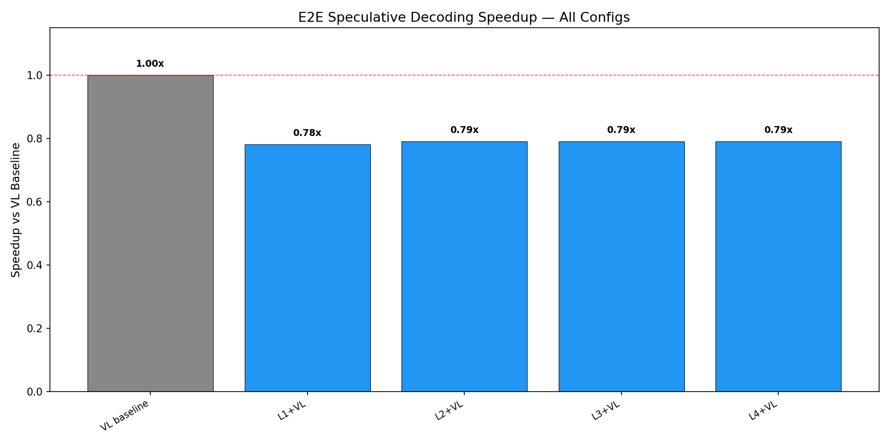
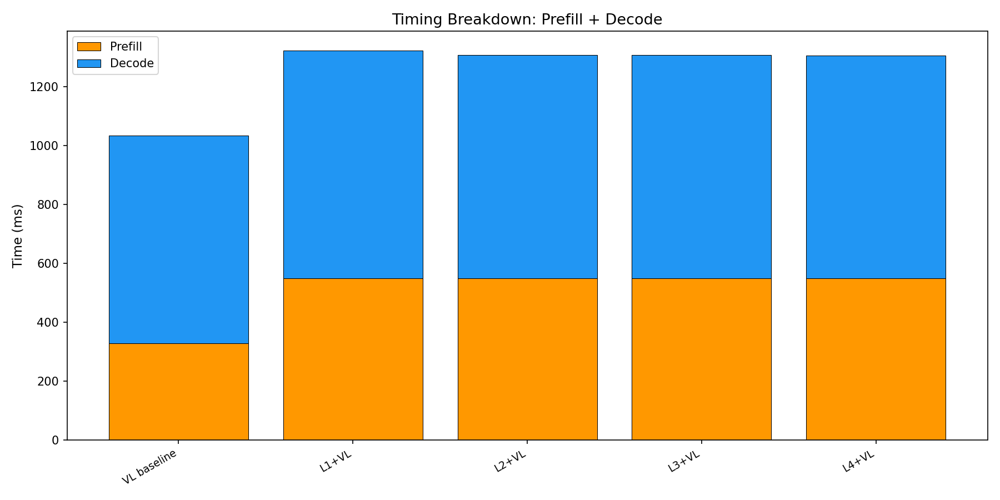

# E2E Wall-Clock Benchmark — All Methods

Generated: 2026-02-07T10:53:40.102598

## Configuration
- Dataset: `/mnt/hdd/data/my_egpt_dsec_test/my_egpt_dsec_seq_1s`
- Samples: 10 (after 0 warmup)
- Questions: 10
- Max tokens: 50, gamma: 5

## Results

| Config | Prefill (ms) | Decode (ms) | Total (ms) | Accept | Speedup | FreeTok |
|--------|-------------|------------|-----------|--------|---------|---------|
| VL baseline | 328 | 706 | 1034 | --- | 1.00x | --- |
| L1+VL | 549 | 773 | 1322 | 0.0% | **0.78x** | 13.3 |
| L2+VL | 549 | 758 | 1307 | 0.0% | **0.79x** | 13.3 |
| L3+VL | 549 | 758 | 1306 | 0.0% | **0.79x** | 13.3 |
| L4+VL | 549 | 757 | 1306 | 0.0% | **0.79x** | 13.3 |

## 3-Stage Timing (Both Models)

| Model | Vision (ms) | Prefill (ms) | Decode (ms) | Total (ms) | ms/token |
|-------|------------|-------------|------------|-----------|----------|
| EventGPT | 119.6 | 141.0 | 351.5 | 612.2 | 10.3 |
| Video-LLaVA | 0.0 | 358.2 | 754.9 | 1113.1 | 15.1 |

## Graphs

