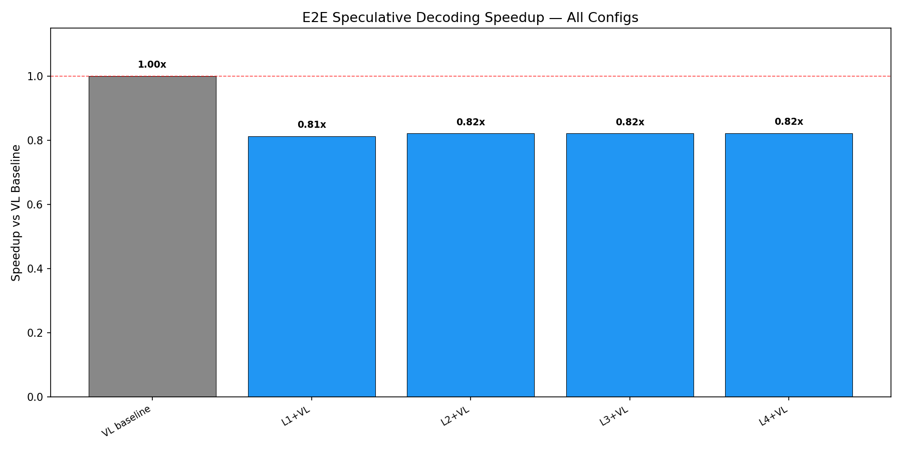
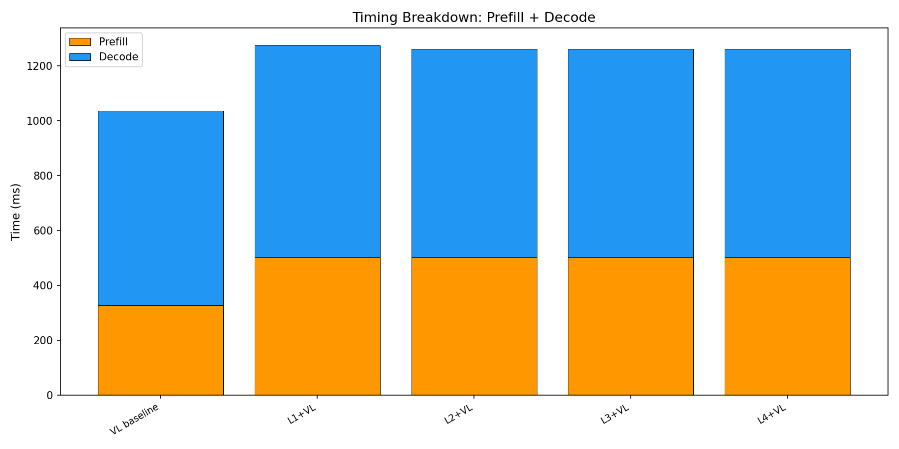

# E2E Wall-Clock Benchmark — All Methods

Generated: 2026-02-07T10:57:05.304511

## Configuration
- Dataset: `/mnt/hdd/data/my_egpt_dsec_test/my_egpt_dsec_seq_1s`
- Samples: 10 (after 0 warmup)
- Questions: 10
- Max tokens: 50, gamma: 5

## Results

| Config | Prefill (ms) | Decode (ms) | Total (ms) | Accept | Speedup | FreeTok |
|--------|-------------|------------|-----------|--------|---------|---------|
| VL baseline | 327 | 709 | 1037 | --- | 1.00x | --- |
| L1+VL | 503 | 772 | 1274 | 0.0% | **0.81x** | 11.4 |
| L2+VL | 503 | 760 | 1262 | 0.0% | **0.82x** | 11.4 |
| L3+VL | 503 | 759 | 1262 | 0.0% | **0.82x** | 11.4 |
| L4+VL | 503 | 759 | 1261 | 0.0% | **0.82x** | 11.4 |

## 3-Stage Timing (Both Models)

| Model | Vision (ms) | Prefill (ms) | Decode (ms) | Total (ms) | ms/token |
|-------|------------|-------------|------------|-----------|----------|
| EventGPT | 119.7 | 135.7 | 356.3 | 611.8 | 10.5 |
| Video-LLaVA | 0.0 | 356.2 | 751.2 | 1107.3 | 15.0 |

## Graphs

