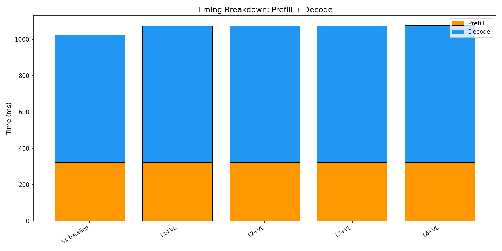

# E2E Wall-Clock Benchmark — All Methods

Generated: 2026-02-07T11:08:00.366799

## Configuration
- Dataset: `/mnt/hdd/data/my_egpt_dsec_test/my_egpt_dsec_seq_1s`
- Samples: 10 (after 0 warmup)
- Questions: 10
- Max tokens: 50, gamma: 5

## Results

| Config | Prefill (ms) | Decode (ms) | Total (ms) | Accept | Speedup | FreeTok |
|--------|-------------|------------|-----------|--------|---------|---------|
| VL baseline | 323 | 701 | 1024 | --- | 1.00x | --- |
| L1+VL | 323 | 750 | 1072 | 0.0% | **0.95x** | 22.3 |
| L2+VL | 323 | 751 | 1073 | 0.0% | **0.95x** | 22.3 |
| L3+VL | 323 | 752 | 1075 | 0.0% | **0.95x** | 22.3 |
| L4+VL | 323 | 754 | 1077 | 0.0% | **0.95x** | 22.3 |

## 3-Stage Timing (Both Models)

| Model | Vision (ms) | Prefill (ms) | Decode (ms) | Total (ms) | ms/token |
|-------|------------|-------------|------------|-----------|----------|
| EventGPT | 120.0 | 136.3 | 344.0 | 600.3 | 10.1 |
| Video-LLaVA | 0.0 | 345.6 | 736.2 | 1081.8 | 14.7 |

## Graphs

