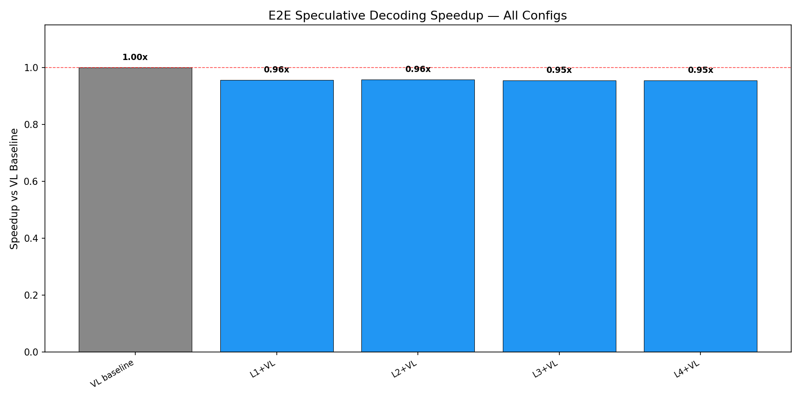
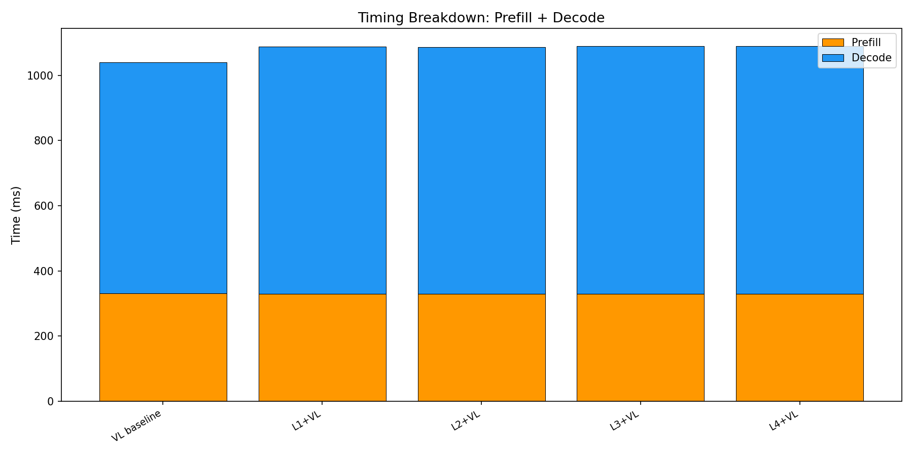

# E2E Wall-Clock Benchmark — All Methods

Generated: 2026-02-07T11:15:37.425842

## Configuration
- Dataset: `/mnt/hdd/data/my_egpt_dsec_test/my_egpt_dsec_seq_1s`
- Samples: 10 (after 0 warmup)
- Questions: 10
- Max tokens: 50, gamma: 5

## Results

| Config | Prefill (ms) | Decode (ms) | Total (ms) | Accept | Speedup | FreeTok |
|--------|-------------|------------|-----------|--------|---------|---------|
| VL baseline | 330 | 709 | 1040 | --- | 1.00x | --- |
| L1+VL | 329 | 759 | 1088 | 0.0% | **0.96x** | 22.0 |
| L2+VL | 329 | 757 | 1086 | 0.0% | **0.96x** | 22.0 |
| L3+VL | 329 | 761 | 1090 | 0.0% | **0.95x** | 22.0 |
| L4+VL | 329 | 760 | 1089 | 0.0% | **0.95x** | 22.0 |

## 3-Stage Timing (Both Models)

| Model | Vision (ms) | Prefill (ms) | Decode (ms) | Total (ms) | ms/token |
|-------|------------|-------------|------------|-----------|----------|
| EventGPT | 122.0 | 141.4 | 354.2 | 617.5 | 10.4 |
| Video-LLaVA | 0.0 | 363.2 | 756.6 | 1119.8 | 15.1 |

## Graphs

