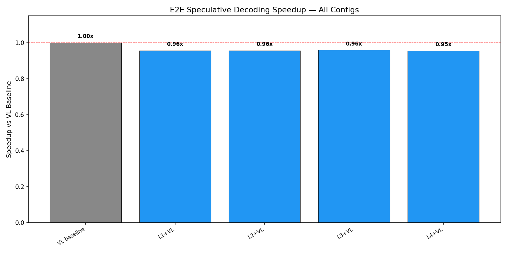
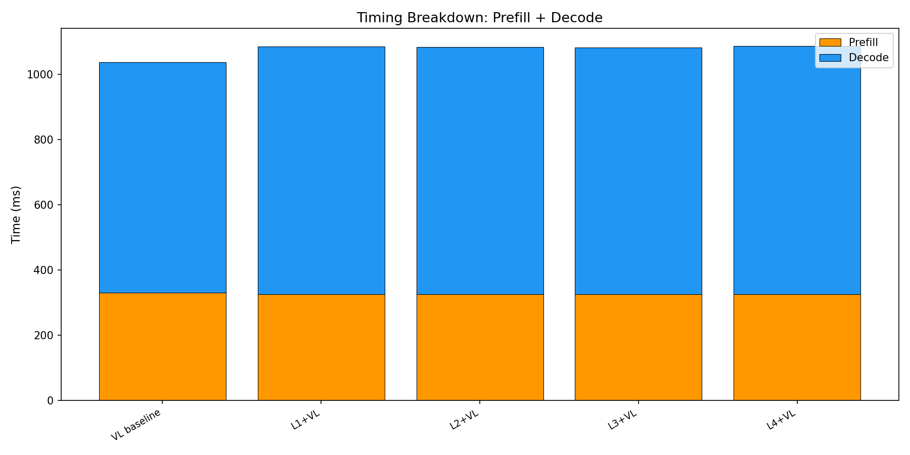
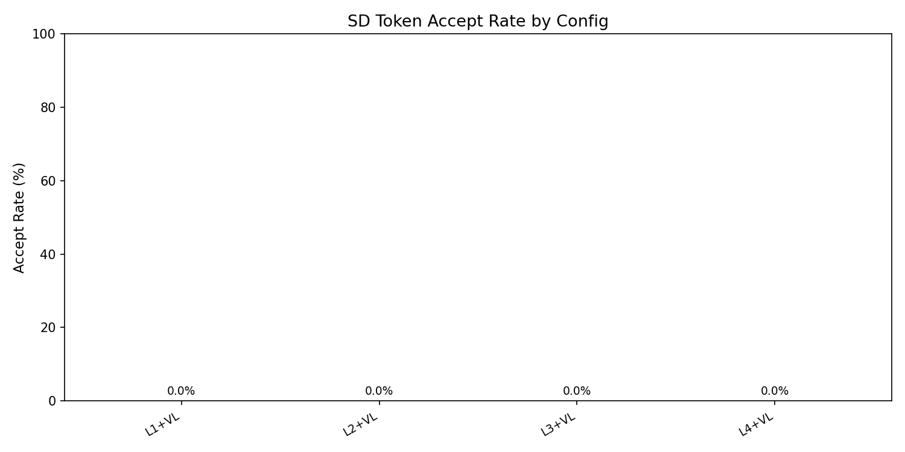

# E2E Wall-Clock Benchmark — All Methods

Generated: 2026-02-07T11:17:26.796055

## Configuration
- Dataset: `/mnt/hdd/data/my_egpt_dsec_test/my_egpt_dsec_seq_1s`
- Samples: 10 (after 0 warmup)
- Questions: 10
- Max tokens: 50, gamma: 5

## Results

| Config | Prefill (ms) | Decode (ms) | Total (ms) | Accept | Speedup | FreeTok |
|--------|-------------|------------|-----------|--------|---------|---------|
| VL baseline | 330 | 707 | 1037 | --- | 1.00x | --- |
| L1+VL | 325 | 759 | 1084 | 0.0% | **0.96x** | 21.5 |
| L2+VL | 325 | 759 | 1083 | 0.0% | **0.96x** | 21.5 |
| L3+VL | 325 | 756 | 1081 | 0.0% | **0.96x** | 21.5 |
| L4+VL | 325 | 761 | 1086 | 0.0% | **0.95x** | 21.5 |

## 3-Stage Timing (Both Models)

| Model | Vision (ms) | Prefill (ms) | Decode (ms) | Total (ms) | ms/token |
|-------|------------|-------------|------------|-----------|----------|
| EventGPT | 124.5 | 134.4 | 358.4 | 617.3 | 10.5 |
| Video-LLaVA | 0.0 | 355.8 | 755.6 | 1111.4 | 15.1 |

## Graphs

