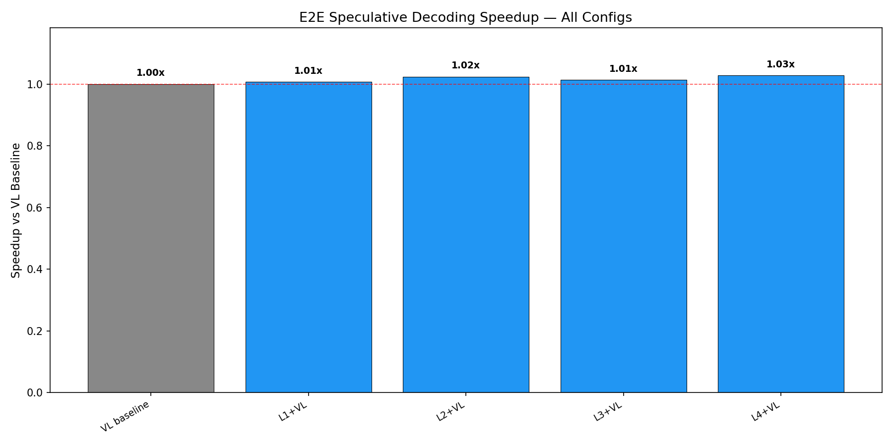
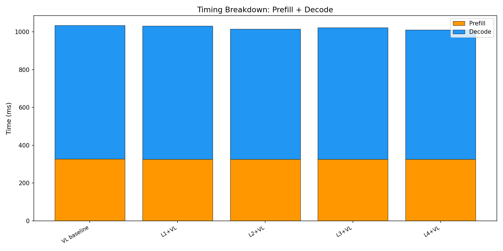
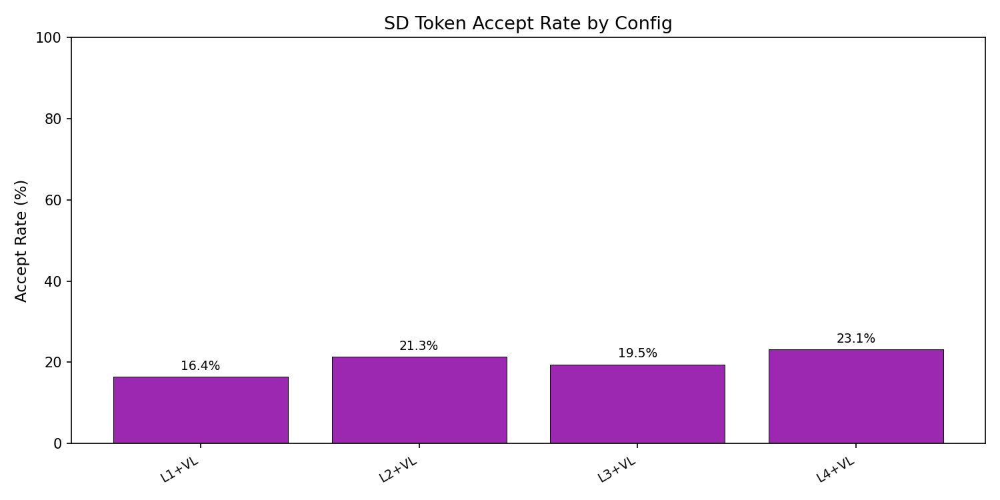

# E2E Wall-Clock Benchmark — All Methods

Generated: 2026-02-07T11:22:08.160331

## Configuration
- Dataset: `/mnt/hdd/data/my_egpt_dsec_test/my_egpt_dsec_seq_1s`
- Samples: 10 (after 0 warmup)
- Questions: 10
- Max tokens: 50, gamma: 5

## Results

| Config | Prefill (ms) | Decode (ms) | Total (ms) | Accept | Speedup | FreeTok |
|--------|-------------|------------|-----------|--------|---------|---------|
| VL baseline | 328 | 706 | 1034 | --- | 1.00x | --- |
| L1+VL | 326 | 705 | 1031 | 16.4% | **1.01x** | 21.8 |
| L2+VL | 326 | 689 | 1015 | 21.3% | **1.02x** | 21.8 |
| L3+VL | 326 | 697 | 1023 | 19.5% | **1.01x** | 21.8 |
| L4+VL | 326 | 685 | 1010 | 23.1% | **1.03x** | 21.8 |

## 3-Stage Timing (Both Models)

| Model | Vision (ms) | Prefill (ms) | Decode (ms) | Total (ms) | ms/token |
|-------|------------|-------------|------------|-----------|----------|
| EventGPT | 121.5 | 142.7 | 353.4 | 617.6 | 10.4 |
| Video-LLaVA | 0.0 | 353.3 | 753.9 | 1107.3 | 15.1 |

## Graphs

