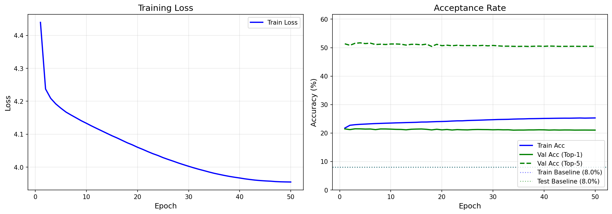

# Token Alignment Results

**Date:** 2026-01-29 21:37:56

## Summary

| Dataset | Samples | Baseline | Model | Top-5 | Improvement |
|---------|---------|----------|-------|-------|-------------|
| Train | 52000 | 8.03% | 23.24% | 53.80% | +15.21% |
| Test | 11000 | 8.05% | 21.48% | 51.52% | +13.44% |

## 5-Stage Timing (Test Set, ms)

| Stage | EventGPT | Video-LLaVA |
|-------|----------|-------------|
| stage1 | 0.0 ± 0.0 | 0.0 ± 0.0 |
| stage2 | 0.0 ± 0.0 | 0.0 ± 0.0 |
| stage3 | 0.0 ± 0.0 | 0.0 ± 0.0 |
| stage4 | 0.0 ± 0.0 | 0.0 ± 0.0 |
| stage5 | 0.0 ± 0.0 | 0.0 ± 0.0 |
| total | 0.0 ± 0.0 | 0.0 ± 0.0 |

## Training Curves

- Loss curve: [loss_curve.png](loss_curve.png)
- Accuracy curve: [accuracy_curve.png](accuracy_curve.png)

## Configuration

- Epochs: 50 (early stopping: 999)
- Batch size: 32
- Learning rate: 0.0001
- Model parameters: 45,486,346

## Speedup Analysis

With acceptance rate α = 21.5% and γ = 5 draft tokens:
- Theoretical speedup: 1.27x
