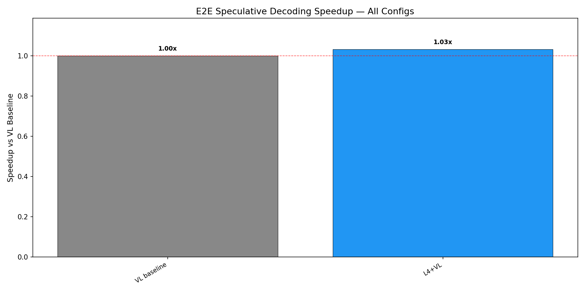
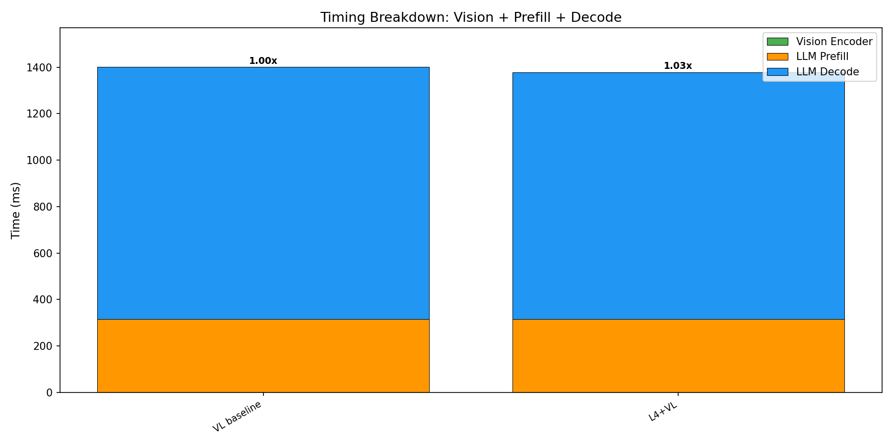
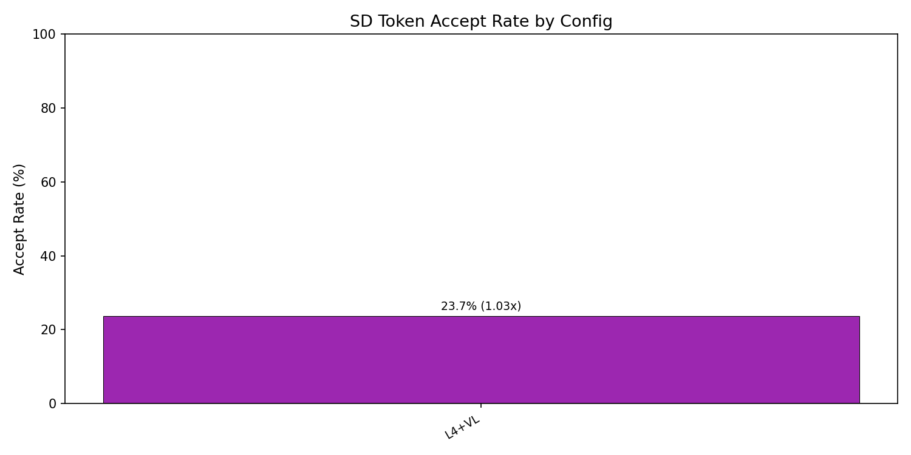

# E2E Wall-Clock Benchmark — All Methods

Generated: 2026-02-10T06:41:36.896612

## Configuration
- Dataset: `/mnt/hdd/data/my_egpt_dsec_test/my_egpt_dsec_seq_1s`
- Samples: 10970 (after 3 warmup)
- Questions: 10
- Max tokens: 512, gamma: 5

## Results

| Config | Prefill (ms) | Decode (ms) | Total (ms) | Accept | Speedup | FreeTok |
|--------|-------------|------------|-----------|--------|---------|---------|
| VL baseline | 316 | 1086 | 1401 | --- | 1.00x | --- |
| L4+VL | 316 | 1062 | 1378 | 23.7% | **1.03x** | 21.6 |

## 3-Stage Timing (Both Models)

| Model | Vision (ms) | Prefill (ms) | Decode (ms) | Total (ms) | ms/token |
|-------|------------|-------------|------------|-----------|----------|
| EventGPT | 8.6 | 83.1 | 440.1 | 531.8 | 10.0 |
| Video-LLaVA | 0.0 | 315.5 | 1311.7 | 1627.2 | 14.6 |

## Graphs

